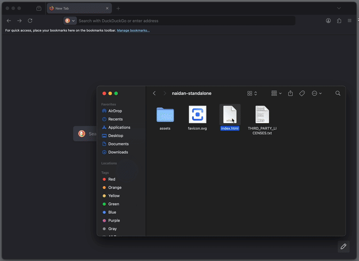

<p align="center">
  
  <h1 align="center">Naidan</h1>
</p>


> [!NOTE]
> Most of this codebase was generated by Gemini with significantly less human review than usual.



A privacy-focused LLM interface for local use, designed to run directly from a portable directory.

Naidan is derived from the Japanese word for "private talk" or "confidential discussion."

## Philosophy: Why `file://`?

The core mission of this project is **radical privacy through minimal trust**.

In security, the strongest defense is to minimize the number of entities you must rely on. However, most local AI tools run as desktop applications, CLIs, or background servers (like Python scripts or Docker containers). While convenient, these native processes operate with **broad system privileges** that are difficult for users to audit or control. Unlike a web app confined to a browser sandbox, a typical desktop app or CLI generally has access to:

-   **Unrestricted File System:** Reading personal documents, SSH keys, and configuration files.
-   **System Introspection:** Monitoring running processes, installed applications, and clipboard contents.
-   **Low-Level Networking:** Establishing background connections or opening ports that evade standard browser security policies (CORS/CSP).

To us, **true serverless means no native process at all**. By running entirely inside the browser via `file://`, Naidan voluntarily accepts the browser's strict security model. It cannot access your arbitrary files or "phone home" without your explicit action.

By supporting the `file://` protocol, we achieve true accessibility and security:
- **Minimal Trust Model**: Security is transparent. You only need to trust your browser and the code within the HTML file itself. There are no opaque background server processes to audit or manage.
- **Zero Configuration**: No server setup, no command line, and no environment to manage. It is the ultimate portable application.
- **Freedom from Port Friction**: Ports are arbitrary numbers, difficult to associate with specific apps, and prone to collisions. By bypassing the server layer, we eliminate port management and the frustration of "Address already in use" errors entirely.

## Getting Started

https://github.com/user-attachments/assets/277e8469-bc11-4391-aadd-89e3384f2017

Naidan provides multiple ways to run the application, allowing you to choose the balance of convenience and control that fits your needs.

### Option 1: Standalone
Download the zip package containing the HTML file and assets, then open it directly in your browser as `file://`. No installation, no terminal, no background processes.

- **Download:** [naidan-standalone.zip](https://naidan.pages.dev/naidan-standalone.zip)
- **Mirrors:** [GitHub Releases](https://github.com/nwtgck/naidan/releases/download/v0.1.0/naidan-standalone-v0.1.0.zip) or GitHub Actions Artifacts.
- **Usage:** Unzip and just double-click `index.html`.
- **Update:** Just delete the old standalone folder and replace it with the new one. Your data is stored in your browser, so it's safe to swap versions.

### Option 2: Self-Hosted Static Files
**For those who require a standard HTTP Origin.**
Using `file://` results in `Origin: null`, which some backend CORS policies may reject. Use this optimized static build if you need a valid Origin (e.g., `http://localhost:8080`) or simply prefer using your own tools like `python3 -m http.server`, `npx serve`, or Nginx.

- **Download:** [naidan-hosted.zip](https://github.com/nwtgck/naidan/releases/download/v0.1.0/naidan-hosted-v0.1.0.zip)
- **Usage:** Serve the extracted directory with your preferred HTTP server.
- **Update:** Replace the old files with the new version. Your data stays safely in your browser.

### Option 3: Dedicated Server Binary
A portable executable that serves the application locally without requiring Python, Node.js, or any other runtime.

- **Download:** [naidan-server](https://github.com/nwtgck/naidan/releases)
- **Update:** Replace the old binary with the new one. Your data is preserved in your browser.

### Option 4: Online Version
**Instant access with zero setup.**
Run Naidan directly from the web. Your data remains local, stored in your browser.

- https://naidan.pages.dev
- https://naidan-only-local.pages.dev: A hardened version with a Content-Security-Policy (CSP) that *only* allows connections to localhost APIs.
- **Update:** Just refresh the page. Your data remains in your browser.

## Key Features

- **Privacy-First & Fully Local**: Your data never leaves your browser. All conversations are stored locally using OPFS or LocalStorage. Combined with the serverless architecture, it ensures complete data sovereignty.
- **Broad Compatibility**: Seamlessly connect to **Ollama** or any **OpenAI-compatible API** (such as vLLM, LM Studio, or llama-server) to power your local AI experience.
- **Branching**: Effortlessly fork or edit any message to create complex, tree-structured conversations without losing context.
- **Intuitive Organization**: Seamlessly manage your chats using a drag-and-drop sidebar with support for custom groups and reordering.
- **Rich Rendering**: First-class support for Markdown, LaTeX mathematical equations (KaTeX), and Mermaid diagrams.
- **Lightweight**: While Open WebUI requires a Docker image exceeding 3GB, this entire application is just a few megabytes. It's built for speed and efficiency.

## Cross-Tab Synchronization

https://github.com/user-attachments/assets/37c75fef-a3f7-4269-8d95-eb5f6cd01cb5

Naidan ensures that your chat history, settings, and organization stay consistent across all open tabs and windows of the application without any manual refreshing. This prevents the common frustration of "stale" tabs accidentally overwriting your latest work, allowing you to seamlessly multitask across multiple windows or monitors.

This is achieved through **serverless client-side state synchronization** using modern web standards, requiring no backend coordinator:

-   **[Web Locks API](https://developer.mozilla.org/en-US/docs/Web/API/Web_Locks_API)**: Orchestrates atomic storage operations to prevent race conditions. In environments where this API is unavailable, the application continues to operate without locks while still prioritizing data integrity.
-   **Hybrid Signaling**: Combines the **[BroadcastChannel API](https://developer.mozilla.org/en-US/docs/Web/API/BroadcastChannel)** with **LocalStorage `storage` events**. This ensures reliable real-time synchronization across tabs even in environments where some modern APIs may have restrictions.

## URL Parameters


Naidan supports URL fragment parameters (following the `#`) to automate actions or deep link into specific states. This allows you to create bookmarks or shortcuts that perform pre-defined tasks.

-   `q`: **Auto-Prompt**. Automatically creates a new chat and sends this message upon opening.
-   `model`: **Model Override**. Specifies the model ID to use for the new chat.
-   `chat-group`: **Target Group**. The name or ID of the group for the new chat. If the group doesn't exist, it is created automatically.
-   `system-prompt` (or `sp`): **System Prompt Override**. Specifies the system prompt for the new chat. This will set the chat's system behavior to `override` with the provided content.

### Examples

-   **Quick Question**: Start a chat immediately with a prompt.
    `index.html#/?q=%s`
-   **Custom Behavior**: Start a chat with a specific system instruction.
    `index.html#/?sp=You+are+a+concise+assistant&q=%s`
-   **Organized Chat**: Start a chat directly inside a specific group.
    `index.html#/?chat-group=Work&q=%s`

## Development

If you want to modify the code or build from source:

```bash
npm ci
npm run dev   # Start the development server
npm run build # Generates the optimized output in the dist/ directory
```
