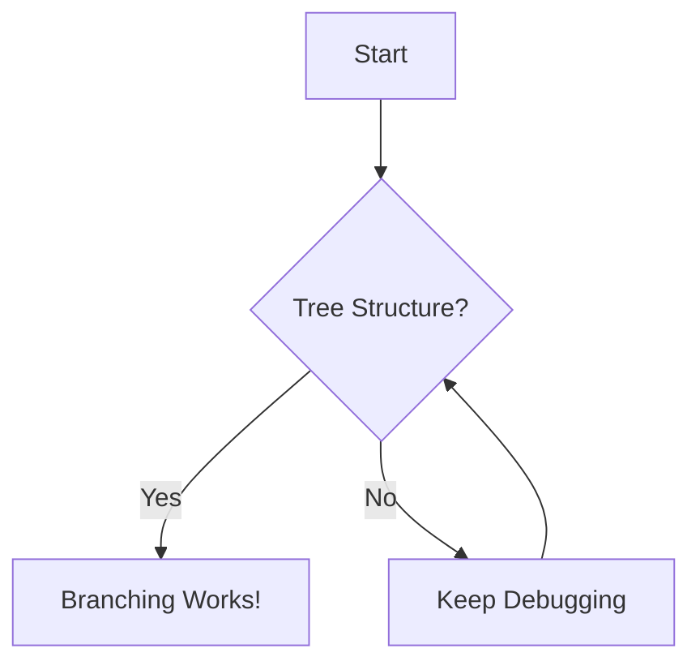

<think>
The user wants to see a comprehensive demonstration of my rendering capabilities.
I should include:
1. A thought process block (this one).
2. Code blocks in various languages (Python, TypeScript, Rust).
3. Mathematics using LaTeX.
4. Diagrams using Mermaid.
5. Markdown features like tables and task lists.
</think>

### 1. Code Syntax Highlighting

**Python:**
```python
def greet(name: str) -> str:
    return f"Hello, {name}!"

print(greet("World"))
```

**Rust:**
```rust
fn main() {
    println!("Hello, tree-based chat!");
}
```

### 2. Mathematics (KaTeX)

When $a \ne 0$, there are two solutions to $ax^2 + bx + c = 0$ and they are:
$$x = {-b \pm \sqrt{b^2-4ac} \over 2a}$$

### 3. Diagrams (Mermaid)



### 4. Rich Markdown & Task Lists

- [x] Support for **bold** and *italic*
- [x] Support for [links](https://github.com)
- [x] Support for Task Lists

| Feature | Status |
| :--- | :--- |
| Recursion | ✅ |
| Branches | ✅ |
| Paging | ✅ |

> "The best way to predict the future is to invent it." - Alan Kay
