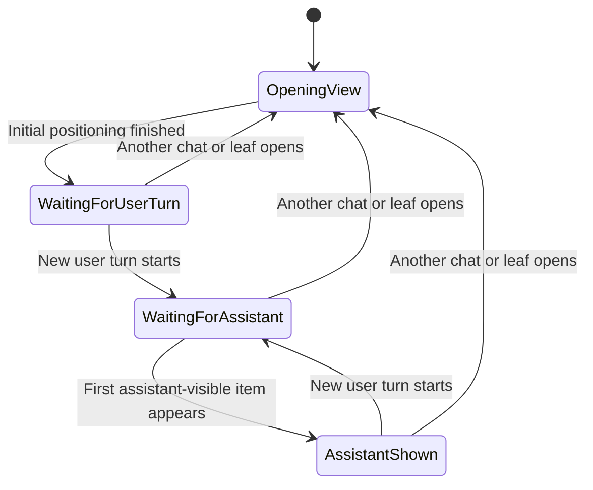

# Chat Area Auto-Scroll Spec

## Rules

1. When a chat view opens, the chat area positions itself immediately without animation.
2. If the current branch has a user message, the latest user message is placed near the top.
3. If the current branch has no user message, the view goes to the bottom.
4. After a new user message starts a turn, the chat area becomes eligible for one assistant auto-scroll.
5. That auto-scroll happens when the first assistant-visible item for that turn appears.
6. That auto-scroll is smooth.
7. It happens at most once per user turn.
8. A new chance begins only when a newer user message starts a new turn.

## State Diagram

## Notes

- `abort` does not create a new auto-scroll chance.
- Streaming updates do not create a new auto-scroll chance.
- Tool updates do not create a new auto-scroll chance.
- The first assistant-visible item may be a message, a process sequence, or a standalone tool group.
